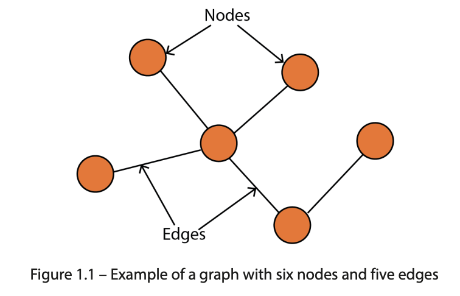

# Chapter 1: Getting Started with Graph Learning

### Revision List for Interview: Introduction

- **Objective of the chapter**
  - Answer three essential questions to understand GNNs:
    1. **Why graphs?**
       - Graphs as a representation of data.
       - Widely used in computer science, biology, and finance.
    2. **Why graph learning?**
       - Applications of graph learning.
       - Different families of graph learning techniques.
    3. **Why GNNs?**
       - Unique features of GNNs.
       - Performance and comparison to other methods.

### Revision List for Interview: Overview

- **Chapter goal**
  - Understand the importance of GNNs and their real-world applications.
  - Gain foundational knowledge to dive into advanced topics.
- **Main topics covered in the chapter**
  - **Why graphs?**
  - **Why graph learning?**
  - **Why graph neural networks?**

### Revision List for Interview: Why Graphs?

- **What are graphs?**
  - Visual representation of nodes (vertices) and edges.
  - Used to model entities and their relationships.
- **Importance of graph theory**
  - Fundamental tool for understanding complex systems and relationships.
- **Versatility of graphs**
  - Applied in various domains, including:
    - **Computer Science**: Models structure of computer programs and system components.
    - **Physics**: Models physical systems and interactions (e.g., particles).
    - **Biology**: Models biological systems (e.g., metabolic pathways).
    - **Social Sciences**: Studies complex social networks (e.g., relationships between individuals).
    - **Finance**: Analyzes stock market trends and relationships between financial instruments.
    - **Engineering**: Models systems like transportation networks and power grids.
- **Graph applications beyond natural relational structures**
  - **Images**: Each pixel as a node, edges represent relationships between pixels for image processing.
  - **Sentences**: Words as nodes, edges represent relationships between adjacent words, used in NLP tasks.
- **Challenges with graphs**
  - No fixed structure, arbitrary nodes and edges.
  - Dynamic nature: connections can change over time, e.g., new users, products, or relationships.
- **Next section**: Use of graphs with machine learning for applications.

### Revision List for Interview: Why Graph Learning?

- **Graph learning**:
  - Application of machine learning to graph data.
  - Focus on understanding and manipulating graph-structured data.
- **Key graph learning tasks**:
  - **Node classification**: Predict the category of a node (e.g., online users, items).
  - **Link prediction**: Predict missing links between nodes (e.g., social network connections).
  - **Graph classification**: Categorize graphs (e.g., molecular structures for drug design).
  - **Graph generation**: Generate new graphs with specific properties (e.g., molecular structures).
- **Practical applications**:
  - **Recommender systems**: Suggest items based on relationships and interactions.
  - **Traffic forecasting**: Improve travel time predictions using complex route relationships.
- **Prominent graph learning techniques**:
  1. **Graph signal processing**: Analyzes graph structure (e.g., Fourier transform, spectral analysis).
  2. **Matrix factorization**: Finds low-dimensional representations for large matrices.
  3. **Random walk**: Simulates movements in graphs to gather relationship information.
  4. **Deep learning**: Uses neural networks to encode graph data as vectors for various tasks.
- **Hybrid models**:
  - Combine techniques to leverage strengths.
  - Example: Matrix factorization + deep learning for low-dimensional graph data representations.

### Revision List for Interview: Graph Learning & Datasets

- **Traditional tabular datasets**
  - Data as rows (data points) and columns.
  - Example: Spreadsheets.
- **Real-world scenarios**
  - Relationships between data points meaningful.
- **Graph datasets**
  - Data points = nodes.
  - Relationships between data points = edges.

### Revision List for Interview: Family Dataset Example

- **Tabular dataset**
  - Attributes: Name, Age, Gender.
  - Lacks representation of relationships between individuals.
- **Graph dataset**
  - Nodes: Family members (with attributes).
  - Edges: Relationships between family members.
- **Significance**
  - Graph format captures connections (relationships).
  - Connections crucial for deeper understanding of the data.
  - Graph representation increasingly popular for relational data.

### Revision List for Interview: Why Graph Neural Networks (GNNs)?

- **Focus**
  - GNNs: Part of the deep learning family.
  - Designed specifically for graph-structured data.
- **Comparison to traditional deep learning**
  - Traditional models: Built for text and images.
  - GNNs: Process and analyze graph datasets effectively.
- **Figure 1.4 (Tasks GNNs handle)**
  - **Node classification**: Predict labels for individual nodes.
  - **Link prediction**: Identify relationships (edges) between nodes.
  - **Graph classification**: Classify entire graphs based on structure and properties.

### Revision List for Interview: GNN Applications

- **General impact**
  - GNNs: Powerful tool for graph learning.
  - Effective across various tasks and industries.
- **Case study: Antibiotic discovery**
  - Model trained on **2,500 molecules**; tested on **6,000 compounds**.
  - Predicted **halicin**: Effective against antibiotic-resistant bacteria.
  - Halicin properties:
    - Kills antibiotic-resistant bacteria.
    - Low toxicity to human cells.
  - Successful treatment of infected mice.
  - Potential: Design new drugs using GNNs.

### Revision List for Interview: How GNNs Work

- **Node classification task example**
  - Example: Social network (like the family tree from Figure 1.3).
  - GNNs use information from:
    - Node features (e.g., age, name, gender).
    - Edge features (e.g., strength of relationships).
    - Global features (e.g., network-wide statistics).
- **Efficiency of GNNs**
  - Enrich original node features with additional data.
  - More comprehensive, meaningful node representation.
  - Traditional ML techniques are limited to original attributes.
- **Graph Convolution Operation**
  - Aggregates information from neighboring nodes and edges.
  - Updates node representation iteratively.
  - Learns complex relationships as iterations increase.
- **Example: Figure 1.5**
  - Shows GNN computation for node 5 based on its neighbors.
  - Multiple GNN layers aggregate data in steps.
  - Simplified illustration of a computation graph.

### Revision List for Interview: GNN Variants and Selection

- **Different types of GNNs**
  - Various GNN architectures and layers.
  - Each has a unique structure and aggregation method for neighboring nodes.
- **Advantages and limitations**
  - GNN variants suited for specific graph data and tasks.
- **Selecting the right GNN**
  - Important to understand:
    - Characteristics of graph data.
    - Desired task/outcome.

### Revision List for Interview: Data Requirements for GNNs

- **Data requirements for GNNs**
  - GNNs need substantial data to perform effectively.
- **Traditional ML techniques**
  - Better for small datasets (less reliant on large amounts of data).
  - Do not scale as well as GNNs.
- **Advantages of GNNs**
  - Can handle larger datasets due to parallel and distributed training.
  - More efficient in exploiting additional information.
  - Leads to better results with large datasets.

### Revision List for Interview: Chapter Summary

- **Three main questions answered**
  - **Why graphs?**
    - Versatile for representing various data types: social networks, transportation, text, and images.
  - **Why graph learning?**
    - Applications: node classification, graph classification.
    - Four main families of graph learning techniques.
  - **Why GNNs?**
    - Superiority over other techniques, especially for large, complex datasets.
- **Importance of GNNs**
  - Becoming vital tools in machine learning due to their ability to handle large, complex data.
- **Next chapter preview: Graph Theory for GNNs**
  - Focus: Basics of graph theory (adjacency matrices, degrees).
  - Types of graphs: directed, undirected, weighted, unweighted.
  - Applications of different graph types.

### Revision List for Interview: Further Reading

- **[1] F. Xia et al. (2021)**
  - Title: _Graph Learning: A Survey_
  - Published in _IEEE Transactions on Artificial Intelligence_
  - DOI: [10.1109/tai.2021.3076021](https://arxiv.org/abs/2105.00696)
  - Link: [arxiv.org/abs/2105.00696](https://arxiv.org/abs/2105.00696)
- **[2] A. Trafton (2020)**
  - Title: _Artificial Intelligence Yields New Antibiotic_
  - Published by _MIT News_
  - Link: [news.mit.edu/2020/artificial-intelligenceidentifies-new-antibiotic-0220](https://news.mit.edu/2020/artificial-intelligenceidentifies-new-antibiotic-0220)
